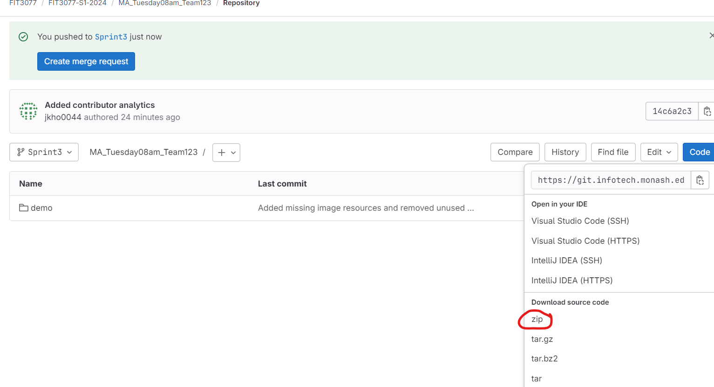
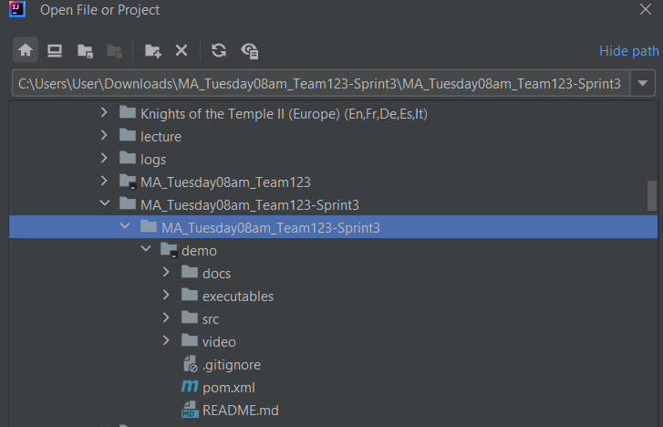
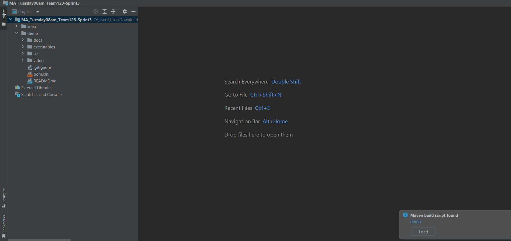
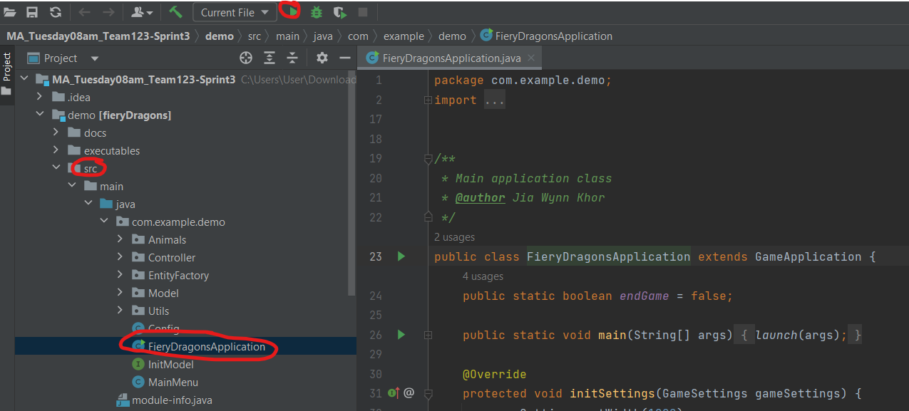
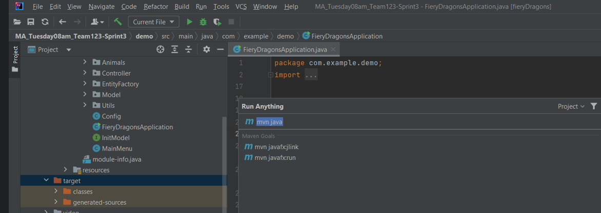
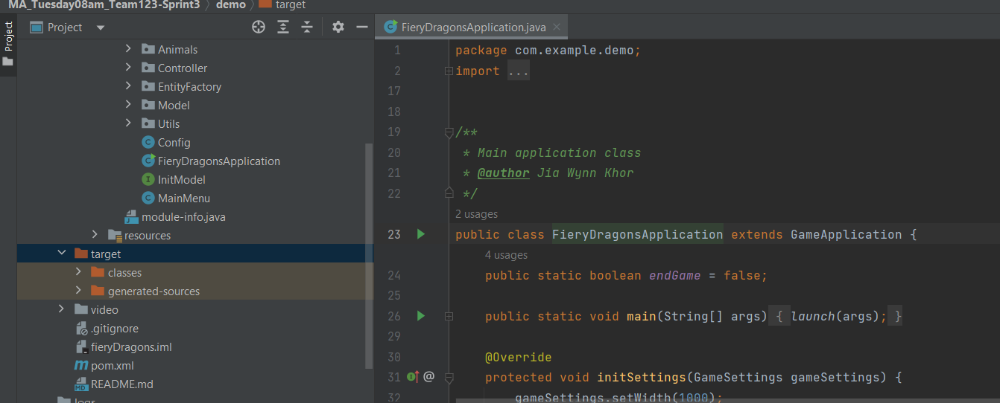
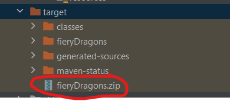

# FIT3077 Sprint 4
Team: Swift Crafters

Authors:
- Maliha Tariq
- Loo Li Shen
- Khor Jia Wynn
- Dizhen Liang

Platform: WINDOWS 

Java SDK: 22

# Navigating the repository
## demo/docs
This folder contains the single PDF containing all drawn/written deliverables

## demo/executables

This folder contains the built executable for launching the game:
- zip file: fieryDragons.zip
  - Platform: Windows
  - Steps to run application:
    - Download and extract zip file.
    - Open a terminal and navigate to fieryDragons/bin, where 'fieryDragons' is the extracted folder. Example ```cd Downloads/fieryDragons/bin```
    - Run the command ```./start-game``` to launch the game application.

## demo/src/main
This folder contains two subfolders for the Technical Work-In-Progress:
- resources
  - This folder contains a folder 'com/example/demo/assets' which contains all the .png resources for the UI.
- java
  - This folder contains a folder 'com/example/demo' which contains all the Java source code.
  - It also contains a module-info.java file which specifies the dependencies required.


## demo/video
This folder contains a video of the prototype demonstration.


# Manually building the executable zip file. 
The executables were built using Maven based on the pom.xml file. The video in the demo/video folder provides a short walkthrough.
See demo/executables for the built executable if you want to skip this step.

The easiest way to build the executable is to download the entire repository as a zip file:





The outer folder 'MA_Tuesday08am_Team123-Sprint3' is extracted from the downloaded zip file.
In IntelliJ, open the inner folder (same name as outer folder) as shown in the above image.

If you see this prompt:



Select 'load' for Maven to build according to the pom.xml file which is present in the repository.
If not, enable Maven support for the project.



To compile and run the application, run the main class "FieryDragonsApplication"


 In your IDE,run the command ```mvn javafx:jlink``` using Maven. In IntelliJ this can be done by pressing the Ctrl key twice, then searching for this command. 

 

Target directory before building the executable:



Target directory after building the executable:

 

# Running the executable
This is also shown in the video demonstration.
 1. For convenience, you may want to copy the zip file and place it into an easily accessible directory, e.g. your Downloads folder
 2. Extract the zip file.
 3. Open a terminal and navigate to fieryDragons/bin, where 'fieryDragons' is the extracted folder. Example ```cd Downloads/fieryDragons/bin```
 4. Run the command ```./start-game``` to launch the game application.


